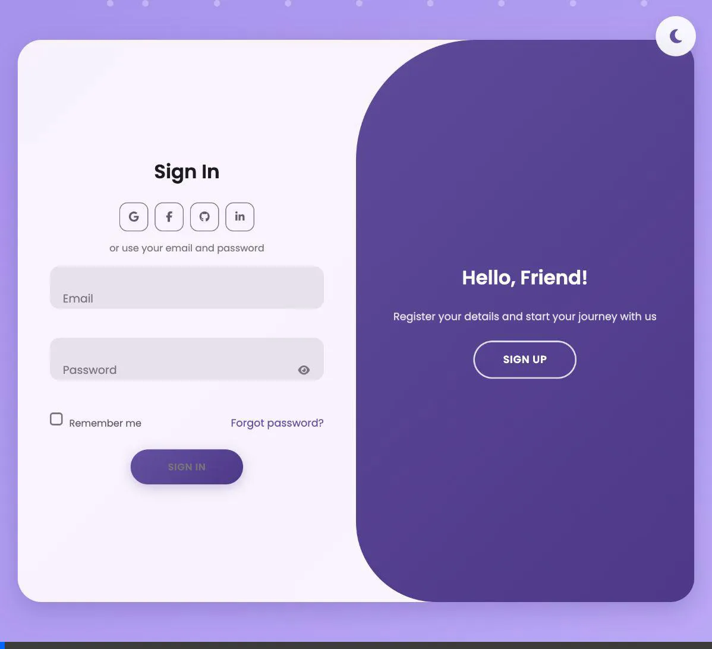
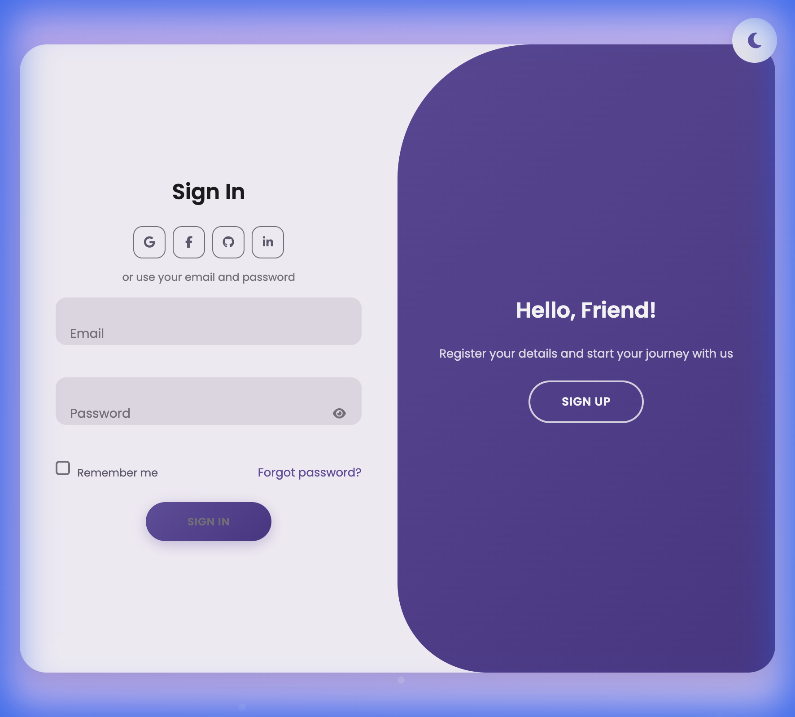
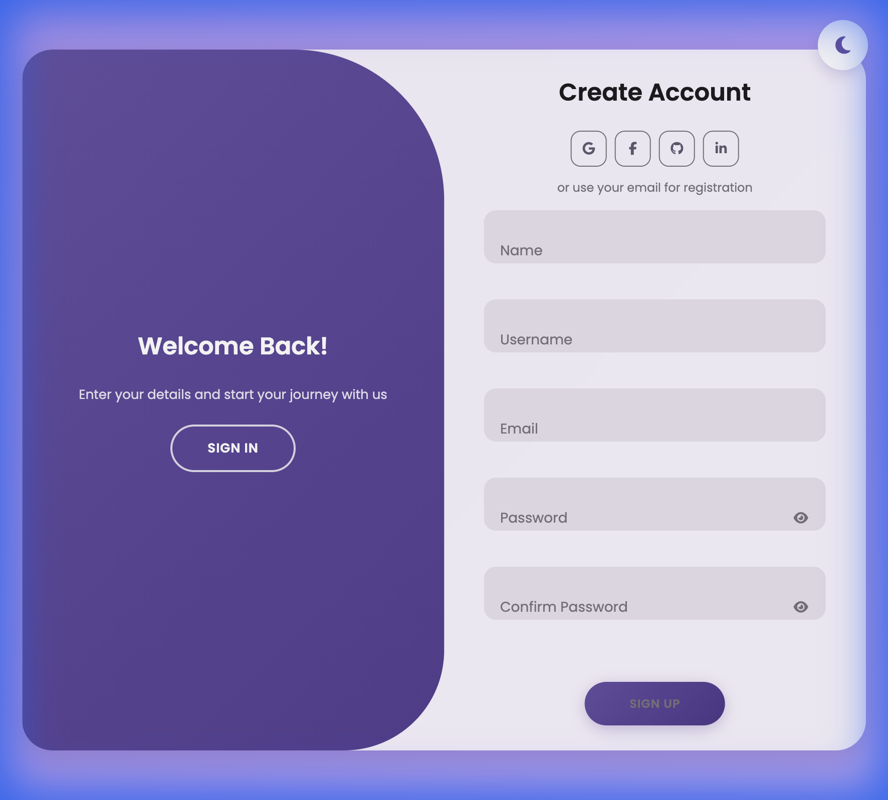

# 🔐 Animated Login Page

A modern, animated login and registration page with smooth transitions, glassmorphism effects, and social login integration.



## ✨ Features

- **Smooth Animations** - Elegant sliding transitions between Sign In and Sign Up forms
- **Glassmorphism Design** - Modern frosted glass effect with backdrop blur
- **Animated Background** - Dynamic floating orbs with gradient colors
- **Social Login** - Integration-ready buttons for Google, Facebook, GitHub, and LinkedIn
- **Responsive Design** - Works beautifully on desktop and tablet devices
- **Password Visibility Toggle** - Show/hide password with animated icon
- **Form Validation Ready** - Structured for easy validation integration

## 📸 Screenshots

| Sign In Form | Sign Up Form |
|:---:|:---:|
|  |  |

## 🛠️ Technologies Used

- **HTML5** - Semantic markup structure
- **CSS3** - Modern styling with:
  - CSS Variables for theming
  - Flexbox layout
  - CSS Animations & Transitions
  - Backdrop filters (glassmorphism)
- **JavaScript** - Form switching and interactivity
- **Font Awesome** - Icon library
- **Google Fonts** - Poppins font family

## 🚀 Getting Started

### Prerequisites
- Any modern web browser (Chrome, Firefox, Safari, Edge)

### Installation

1. Clone the repository:
```bash
git clone https://github.com/yourusername/AnimatedLoginPage.git
```

2. Navigate to the project folder:
```bash
cd AnimatedLoginPage
```

3. Open `index.html` in your browser:
```bash
open index.html
```

Or simply double-click the `index.html` file.

## 📁 Project Structure

```
AnimatedLoginPage/
├── index.html          # Main HTML file
├── style.css           # All styles and animations
├── script.js           # JavaScript functionality
├── screenshots/        # Screenshot images
│   ├── signin.png
│   ├── signup.png
│   └── demo.webp
└── README.md           # This file
```

## 🎨 Customization

### Colors
Edit the CSS variables in `style.css` to customize the color scheme:

```css
:root {
    --primary-gradient: linear-gradient(135deg, #667eea 0%, #764ba2 100%);
    --accent-color: #667eea;
    --text-primary: #1a1a2e;
    --text-secondary: #4a4a6a;
}
```

### Background Animation
Modify the floating orbs in the `.background` section of `style.css`:
- Adjust `animation-duration` for speed
- Change gradient colors for different effects
- Modify `width/height` for orb sizes

## 🤝 Contributing

Contributions are welcome! Feel free to:
1. Fork the repository
2. Create a feature branch (`git checkout -b feature/amazing-feature`)
3. Commit your changes (`git commit -m 'Add amazing feature'`)
4. Push to the branch (`git push origin feature/amazing-feature`)
5. Open a Pull Request

## 📄 License

This project is open source and available under the [MIT License](LICENSE).

## 🙏 Acknowledgments

- [Font Awesome](https://fontawesome.com/) for icons
- [Google Fonts](https://fonts.google.com/) for Poppins font
- Inspired by modern UI/UX design trends

---

<p align="center">Made with ❤️ by Fahim</p>